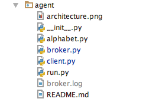

指令交互(agent模块)
================================

源码目录
--------

简介
----

该模块用到了:

* gevent
* pyzmq

交互模块为项目目录下的 `agent` 目录, 其目录下有几个重要的文件:

* alphabet.py

    定义了 `agent` 模块中用到的常量,一般无需更改

* broker.py

    定义了 `Broker` 对象,用于给 run.py 运行 broker,提供指令中转服务

* client.py

    使用 ZMQ 框架下的 REQ 类型 socket 与 broker 通信,
    定义了供 web server 和 socket server 使用的对象,
    分别为 `Demand` 对象和 `Dispose` 对象。

* run.py

    运行 `agent` 模块的程序,其使用到了 `setting.broker` 变量作为运行配置

指令数据请求流程
------------------------

.. image:: _static/interact_struct.png
    :target: _static/interact_struct.png

上面的图中有三个服务程序(蓝色框),维护设备长连接的tcp程序(Gevent StreamServer), agent 模块,
RESTful接口程序(Gevent WSGIServer)。

在项目中的任意模块可以使用 `agent.client.Demand` 对象发送指令给设备
(图例中以 RESTful接口程序 为代表,其请求最为常见),设备必须已经按协议连接上tcp服务器。

示例代码如下:

.. code-block:: python

    from agent.client import Demand, OK, NO, TIMEOUT
    import setting

    client = Demand(setting.broker['host'], setting.broker['request_port'])

    def test(imei):
        result = client.send(imei, '\x10', '')
        if result == OK:
            return 'device respond ok'
        elif result == NO:
            return 'device connection offline'
        elif result == TIMEOUT:
            return 'device respond timeout'
        else:
            return 'bad respond'

示例中 `test` 函数接受设备imei参数,向该imei的设备其发送 0x10 指令,没有附加数据,
具体的指令所带数据参见 :doc:`../devices/instruct`。

Demand 和 Dispose 对象都使用 `agent.client.REQClient` 对象发送指令与,设备的回应,
其在内部使用的是 `zmq.Socket.send_multipart` 和 `zmq.Socket.recv_multipart` 来发送与接收数据。

指令数据通过 Demand.send 发送给 broker 程序后,具体步骤为:

    * `agent.broker.Broker` 对象通过 `agent.broker.Router.recv_loop` 的循环获得指令数据;
    * 在 `agent.broker.Broker.request_handle` 中处理获得的指令数据;
    * 将这次 REQ 的 `'identity frame'` (zmq框架概念)与 `agent.broker.Broker.request_queue` 中某个队列绑定;
    * 通过 `agent.broker.Broker.publish.send` 推送指令数据至所有连接的 Dispose 对象(包括 `identity frame`);
    * Dispose 返回的指令回应在 `agent.broker.Broker.dispose.recv_loop` 中接收;
    * 在 `agent.broker.Broker.dispose_handle` 中处理获得的指令回应;
    * 通过 `agent.broker.Broker.client_result` 字典与指令回应中REQ的 `'identity frame'`,
      获得与本次指令回应所关联的结果队列;

      在 `Broker.request_handle` 中有:

      .. code-block:: python

          message[0] = client_ident
          self.publish.send(message)

      以及 `Broker._dispose_*` 中有:

      .. code-block:: python

          client_ident = data[0]
          box = self.client_result[client_ident]

      其中 Dispose 返回的指令回应 data 中, data[0] 即为 Demand 所发请求的 `identity frame` (message[0])

    * 将指令回应放至队列中(取得的 box 中),此时 Dispose 的任务结束;
    * `agent.broker.Broker.request_handle` 在队列里有可用数据时获得指令回应(等待队列时有设置超时);
    * 将指令的回应返回给对应的 Demand;

Demand 请求后获得的返回值即为 Dispose 对象所返回的回应,有以下几种请求方式。

* Demand.send(imei, instruct, data)

    * agent.alphabet.OK (指令设备已收到)
    * agent.alphabet.NO (该imei设备不在线)
    * agent.alphabet.TIMEOUT (该指令发送后设备没有进行相应回复)

* Demand.send_nowait(imei, instruct, data)

    * agent.alphabet.OK (已将指令发送到 broker 处)

* Demand.find(imei)

    * agent.alphabet.OK (该imei设备当前在线)
    * agent.alphabet.NO (该imei设备当前不在线)

* Demand.getlist(num, page)

    * 返回当前在线的设备imei列表,根据 num(每页数目)、 page(查询页数,0为第一页) 参数返回列表

* Demand.gettotal()

    * 当前在线设备总数

指令数据处理流程
------------------------

设备长连接处理模块 `watch/socket/device.py` 中有:

.. code-block:: python

    def interact(imei, instruct, data):
        """
        返回 OK, NO, TIMEOUT 返回成功、失败、超时
        """
        try:
            conn = DeviceDict[imei]
        except KeyError:
            return NO
        result = conn.interact(instruct, data)
        return result

    def sendtodev(imei, instruct, data):
        """
        返回值忽略
        """
        if imei in DeviceDict:
            DeviceDict[imei].send(instruct, data)

    def generate_dispose():
        return Dispose(DeviceDict, setting.broker['host'], setting.broker['respond_port'],
                       setting.broker['port'], interact=interact, interact_noblock=sendtodev)

`generate_dispose` 为初始化 `Dispose` 对象的函数, 其中 ``DeviceDict`` 为示例图中设备上下线所操作的字典
(字典的键为设备 imei, 值为长连接对象 `device.DeviceConnect` 的实例)。

interact 和 sendtodev 两个函数分别对应着处理 Demand.send 和 Demand.send_nowait 的动作,
处理与设备交互指令和发送指令到设备。
而 Demand.find、Demand.getlist、Demand.gettotal 则不需要额外定义相对应的处理函数,
查找 ``DeviceDict`` 字典内是否有该imei,获得 ``DeviceDict`` 字典的键列表,获得 ``DeviceDict`` 字典的键总数,
都在 `Dispose._handle` 函数中做了处理。

`device.device_upon` 和 `device.device_offs` 分别是设备上线和下线对应的操作, 都对 ``DeviceDict`` 进行了操作,
python 内置的字典结构是线程安全的,加上我们使用的通信框架是 gevent 这个单线程的协程库,所以不需要加锁。

