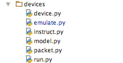

设备长连接服务
====================

源码目录
--------

为设备提供服务的模块有多个, `watch/socket` 为设备提供长连接服务,较为重要,其中有:

* device.py

    定义了设备连接对象,主要抽象为设备当前的连接;
    定义了上下线操作,指令交互方式(`interact`、`sendtodev` 函数);

* emulate.py

    模拟设备连接的模拟器,提供的指令与 :doc:`../devices/instruct` 一一对应,用于测试连接服务器;

* instruct.py

    定义各个指令的处理函数,指令处理函数以 ``'type_'`` 为开头,以指令的类型数字为结尾。 
    在 `devices/device.py` 中有:

    .. code-block:: python

        dispatch = {int(iterm[5:]): getattr(instruct, iterm) for iterm in dir(instruct) if iterm.startswith('type_')}

    dispatch 为指令处理字典,用于获取指令处理函数。

* model.py

    定义了数据库中的数据缓存对象;

* packet.py

    设备指令解析模块,抽象出 `extract` 和 `assemble` 函数,用于解析和打包指令;

* run.py

    运行设备长连接服务的程序,其使用到了 `setting.server` 变量作为运行配置;

指令定义
--------

指令定义在 :doc:`../devices/instruct` 中。

指令解析
--------

在 `packet.extract` 函数中有:

.. code-block:: python

        if length:
        packet = packet[4:]
        while len(packet) < length:
            complement = sock.recv(1024)
            if not complement:
                raise socket.error
            packet += complement
        extra_data = packet[length:]
        data = json.loads(packet[:length])
    else:
        data = {}
        extra_data = packet[4:]

如果该指令包含数据,则取得指令对应的数据参数解析函数,将数据传入,得到指令的参数 params。
指令数据的解析函数在 unpack_handler 中定义。

如果该指令不包含数据,则将得到空字典,如果包含数据,就会得到设备端发送过来的json字典。

在 `packet.extract` 函数中,将设备 socket 对象与上次未处理的数据传给该函数,类似于一般解析对象中的 feed 操作,
没有使用专门的解析类,需要将处理得到的 `extra` 保存起来,下次调用 `packet.extract` 函数时,再传递进去。

所以在 `device.DeviceConnect` 类的 loop 函数(指令处理循环)中有:

.. code-block:: python

    while self._status:
        data, self._extra_data = extract(self._sock, self._extra_data)
        self.handle(data)

将上次指令解析之后得到的数据存在设备连接对象的属性中,下次解析指令时再传递过去, _extra_data 实际为指令处理的缓存。

在 `run.handle` 连接主处理函数中,也有:

.. code-block:: python

    dc = DeviceConnect(sock, imei)
    dc._extra_data = extra_data

解析完连接第一次发送过来的指令之后,如果鉴权完成,生成设备连接对象之后,
将解析完指令的缓存赋值到连接对象中,保证该连接所发送的数据不丢失。

这样的解析方式保证每次应用跟操作系统的数据请求都为固定的、优化过的缓冲区大小(2048、4096,视平台而定)。
也可以一次性读取多个较小的指令,不必产生多次系统调用。

指令处理
--------

在 `device.DeviceConnect.handle` 中有:

.. code-block:: python

    pattern, data = dispatch[itype](self, params)

handle 函数用于处理设备所收到的指令, dispatch 里为 `instruct.py` 模块中以 ``'type_'`` 开头的函数,
以每个指令的类型为索引,找到该处理函数,并将解析得到的参数传递进处理函数。

instruct.py 中的 `type_3` 函数为:

.. code-block:: python

    def type_3(conn, data):
        """
        心跳指令
        """
        return 'send', {}

具体的指令释义在 :doc:`./devices/instruct` 中。

指令处理函数收到设备发送过来,并经过解析转换后得到的参数,对 conn 对象进行操作,
例如 ``type_3`` 函数发送一个空字典至设备,用于保持设备连接在线。

连接处理流程
------------

连接建立后, 由 `run.handle` 函数处理连接;

`device.DeviceConnect.login` 函数运行登录动作;

每个连接新建协程用来运行 `device.DeviceConnect.login_handle` 函数;

`run.device_upon` 函数执行设备上线动作;

`device.DeviceConnect.loop` 函数处理指令循环,登录完成;

