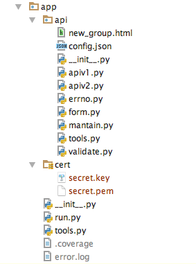

接口服务
============

源码目录
--------

在 `app` 目录中,有以下几个部分:

* api:

    api目录里包含的是实现具体 api 功能的源文件

    * new_group.html

        加入群组时,发送给用户的邮件模板。

    * config.json

        app报名标识与设备的代理商号对应配置,与 `watch/configServe/config.json` 相对应。

    * apiv1.py

        业务处理第一版接口;

    * apiv2.py

        业务处理第二版接口;

    * errno.py

        错误码定义文件;

    * form.py

        接口表单验证文件;

    * mantain.py

        接口运行时定期运行的更新数据的函数;

    * tools.py

        接口处理程序所用到的工具模块;

    * validate.py

        接口表单验证所用到的验证方法类;

* cert

    证书文件夹,用于放置接口程序所使用到的证书;

* run.py

    接口程序运行文件

* tools.py

    方便在 api 文件夹下执行 api/tools.py 里的函数,以及提供一个 ipython 的REPL;

接口定义
--------

接口定义在 `接口文档 </app>`_ 中。

接口示例
--------

在 `app/api/apiv1.py` 中,有:

.. code-block:: python

    @validate_decorator(form.SessionImei())
    def api_watch_locking(data):
        errno = verify_user_and_imei(data['session_user_id'], data['imei'])
        if errno:
            return failed(errno)
        watch = db.watch.find_one({'_id': data['imei']}, {'status': 1})
        if not watch:
            return failed(E_watch_nofind)
        if watch.get('status') == 2:
            return succed()
        result = agent.send(data['imei'], '\x12', '')
        if result == OK:
            db.watch.update_one({'_id': data['imei']}, {'$set': {'status': 2}})
            return succed()
        elif result == NO:
            return failed(E_watch_response_offline)
        else:
            return failed(E_watch_response_timeout)

这个接口的验证器是 `app/api/form.py` 中的 form.SessionImei 类,其定义为:

.. code-block:: python

    class SessionImei(StrictForm):
        session = StringField(required=True, min_length=12, max_length=12)
        imei = StringField(required=True, min_length=15, max_length=15)

表明这个接口解析两个参数, `session` 和 `imei` 参数。
经过验证之后,主要的动作是像设备发送 '0x12' 指令::

    agent.send(data['imei'], '\x12', '')

之后根据设备的返回回应返回给接口请求者。

