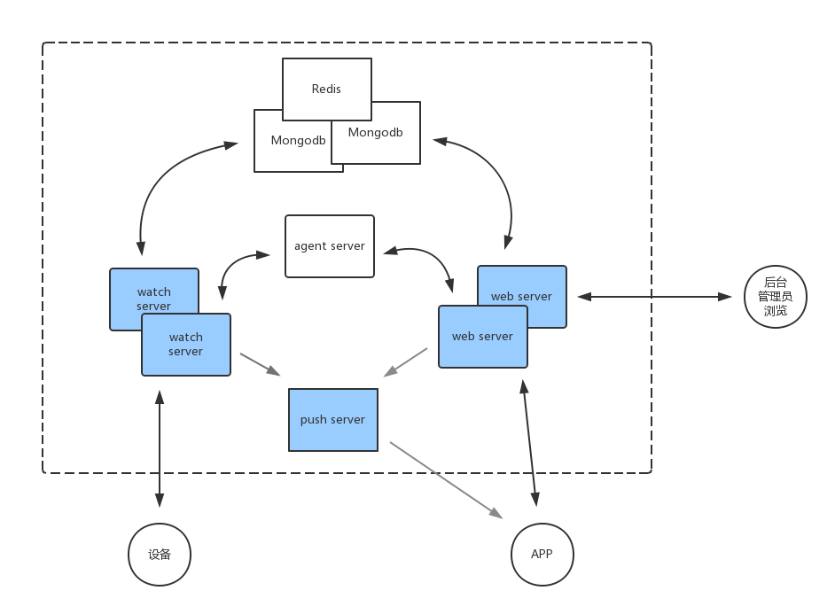
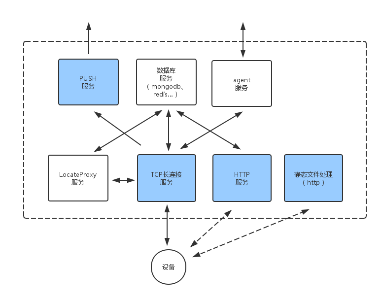
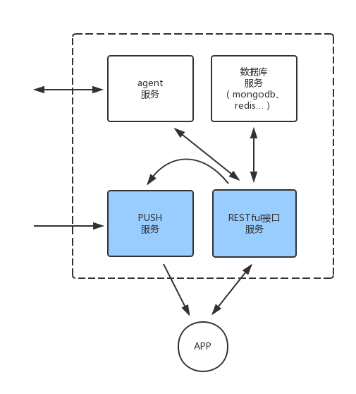
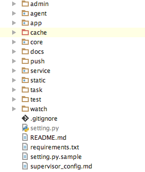

引擎架构
========

结构
----

* 实线为数据在设备、引擎各个server、APP之间的流动, 推送服务的数据流动为单向流动(因接口请求或设备指令触发推送);
* 有多个重复server为可以多实例部署的server;
* 蓝色的服务是引擎暴露给外部的服务,其他模块为内部使用的服务;

结构简图中, watch server 为 `设备连接处理程序 <watch-server_>`_ ,
web server 为 `RESTful接口模块 <web-server_>`_,
agent server 为 `指令交互模块 <agent-server_>`_,
push server 为 `推送模块 <push-server_>`_,
Mongodb 为引擎所使用的数据库后端, 使用 Redis 作为热点数据的缓存。
简图中还有其他模块没有画出,例如 : `定位信息处理模块 <locate-server_>`_ 等

和设备交互的模块如下图:

* 实线为数据在设备、引擎各个server之间的流动, 推送服务的数据流动为单向流动(因设备指令触发推送);
* 指向设备的实线是长连接,虚线是短连接;
* 蓝色的服务是引擎暴露给外部的服务,其他模块为内部使用的服务;

对于设备而言,其面对的服务端为 `设备连接处理程序 <watch-server_>`_ 和 `设备http接口 <watch-http_>`_ ,
这两个服务端接受设备发送过来的指令,并转发 `指令交互模块 <agent-server_>`_ 的指令至设备端。

和APP交互的模块如下图:

* 实线为数据在APP、引擎各个server之间的流动, 推送服务的数据流动为单向流动(因接口请求触发推送);
* 蓝色的服务是引擎暴露给外部的服务,其他模块为内部使用的服务;

其中 `RESTful接口服务 <web-server_>`_ 是主要进行业务处理的服务。

源码
----

引擎用于用户设备与前端交互的中转系统,用户前端为http接口形式,
设备前端为TCP长连接形式,实现设备持续在线,便于前端指令交互。
文档中假设用户已经拥有本引擎的源码,所有的目录说明均相对项目目录。

在下载了引擎源码之后, 在终端下查看如下::

    ➜  /YK01 git:(master) ✗  ls -l
    total 72
    -rw-r--r--   1 root  staff  15655  5 27 11:26 README.md
    drwxr-xr-x  15 root  staff    510  5 27 17:58 admin
    drwxr-xr-x  14 root  staff    476  5 24 17:21 agent
    drwxr-xr-x  13 root  staff    442  5 18 12:07 app
    drwxr-xr-x  13 root  staff    442  4  8 16:32 cache
    drwxr-xr-x  17 root  staff    578  6  9 21:42 core
    drwxr-xr-x   7 root  staff    238  6 21 09:56 docs
    drwxr-xr-x  12 root  staff    408  5 31 16:01 push
    -rw-r--r--   1 root  staff    238  5 26 14:32 requirements.txt
    drwxr-xr-x  11 root  staff    374  6 21 09:33 service
    -rw-r--r--   1 root  staff   2065  5 17 11:32 setting.py
    -rw-r--r--   1 root  staff   2120  5 17 17:10 setting.py.sample
    drwxr-xr-x  12 root  staff    408  5 18 09:50 static
    -rw-r--r--   1 root  staff   1966  5 17 17:10 supervisor_config.md
    drwxr-xr-x   6 root  staff    204  5 10 11:24 task
    drwxr-xr-x  10 root  staff    340  5 20 10:18 test
    drwxr-xr-x   7 root  staff    238  5 17 17:10 watch

该项目由各个模块目录组成, 每个模块目录提供一个微服务, 引擎由各个服务整合而成。

说明
----

引擎源码大致分为以下几个主要模块目录:

设备请求处理后端
^^^^^^^^^^^^^^^^

设备配置模块,也可作为负载均衡用处的设备连接网关,目前用来获取设备初始的域名配置,以及各个设备域名商之间的不同配置参数的获取。::

    watch/configServe/

.. _watch-server:

``设备连接模块`` ,与设备保持长连接,对设备发送过来的指令进行处理,使用项目内的各个有用模块进行业务处理。
将 `agent` 模块发送过来的指令转发至设备端,并将设备反馈的结果返回给 `agent` 模块。::

    watch/socket/

.. _watch-http:

``设备http接口模块`` ,用于处理设备上传语音,图片等大文件的数据。避免阻塞长连接指令处理,提高连接稳定性。::

    watch/http/

web接口请求后端
^^^^^^^^^^^^^^^^

.. _web-server:

``RESTful接口模块`` ,提供RESTful接口服务,提供与设备交互,存取数据,进行业务流程等操作。::

    app/

客服接口模块,属于RESTful接口服务一部分,因为较为独立而作为模块存在。::

    service/

管理后台,对业务定义的数据进行展现与操作,其他页面如文档页面的查看。::

    admin/

资源文件处理,处理业务头像,语音等静态资源的下载,使项目其不依赖 `nginx` 、 `apache` 等http前端也能提供web 静态资源服务。::

    static/

其他内部模块
^^^^^^^^^^^^^^^^

.. _agent-server:

``指令交互模块(agent模块)`` ,负责设备与RESTful接口之间交互指令的程序。::

    agent/

提供项目内所有公共的方法及对象,eg: db、redis等数据库操作对象。::

    core/

项目内的文档,可由 `admin` 模块提供查看,或者作为静态网页资源单独部署提供查阅服务。::

    docs/

.. _push-server:

``推送模块`` ,模块内使用了 apns和 mqtt进行推送,分别针对 IOS用户和安卓用户。::

    push/

维护模块,对数据进行定期的处理,例如一些用户地理坐标的分类、统计。一些陈旧数据的清理,以及测试、收集用的数据的处理。::

    task/

测试模块,检验引擎在各平台的运行基准。以及用于更新业务代码时使代码更加健壮的单元测试。::

    test/

.. _locate-server:

``定位信息处理模块`` ,处理设备通过指令发送到引擎的定位信息,包括基站定位,gps定位等,适合watch server多实例部署的情况下,
对定位信息的统一处理,以及串行化对高德定位接口的请求。::

    watch/LocateProxy/

一些惯例
--------

每个独立的模块文件夹下大部分都有 `run.py` ,可以用::

    > python run.py

来进行运行,运行时配置文件在项目目录下的 `setting.py`

建议使用 `PyCharm` 来导入本项目,导入后如图,可以方便在各个模块之间跳转依赖、查找函数引用情况等。

修改业务代码后, 建议运行 `test` 目录下的测试套件::

    > python testrunner.py

测试通过后再更新至生产用服务器。
