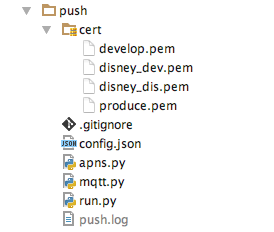
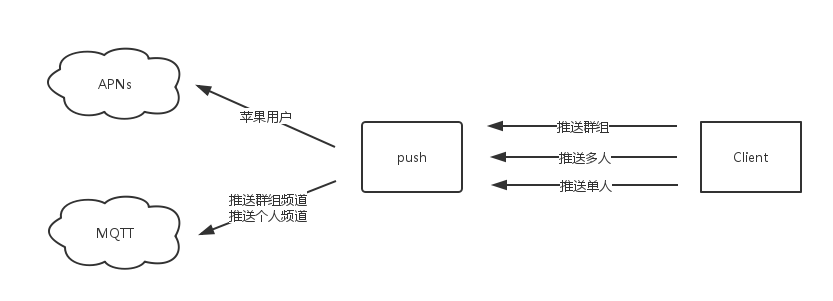

推送服务
================

源码目录
--------

简介
----

该模块用到了:

* gevent
* msgpack-python
* apns-client
* paho-mqtt

在 推送代理模块(代其他客户端执行推送相关动作的模块) 中:

* cert/

    这个目录放置 APNs 推送所用的证书,放置过后,需要在 `push/config.json` 中修改对应文件名;

* config.json

    证书的配置文件, 为 `push/apns.py` 中的 `config` 字典的来源, 用于给相应的 identify 选择相应的证书;

* apns.py

    提供 push_apns 函数给 `push/run.py` 进行推送 APNs;

* mqtt.py

    提供 push_mqtt 函数给 `push/run.py` 进行推送 MQTT;

* run.py

    运行推送模块的程序,其使用到了 `setting.push`、`setting.mqtt` 变量作为运行配置

推送流程
--------

类似 `agent` 模块,本地推送代理服务,也需要使用特定的客户端进行数据的发送,
之后 `push/run.py` 再进行解析并处理,但推送所使用到的客户端是全异步的,没有确认机制。

推送客户端使用方法示例代码:

.. code-block:: python

    from core.proxy import Client
    import setting

    client = Client(setting.push['host'], setting.push['port'])

    def push_to_group(group_id, json_data):
        client(1, group_id, json_data)

    def push_to_users(user_list, json_data):
        client(2, user_list, json_data)

    def push_to_user(user_id, json_data):
        client(3, user_id, json_data)

client 的数据经 msgpack 序列化后通过网路发送给 push 程序,在 `push/run.py` 中有:

.. code-block:: python

    push_type, push_id, data = msgpack.unpackb(pack, use_list=0)

其中 push_type 就是客户端所传递的第一个参数,表示推送的类型,目前定义有三种类型:

* 1

    推送到群组, 第二个参数为群组id

* 2

    推送到多个用户, 第二个参数为用户id列表

* 3

    推送到单个用户, 第二个参数为用户id

推送APNs
--------

如果推送的类型是群组,则需要通过 ``redis.smembers('GroupAppleUser:%s' % group_id)`` 先获得每个群组中为苹果用户的用户id列表。
如果推送的类型是多个用户或者单个用户,则可以直接使用::

    token, ident, version, focus = redis.hmget('User:%s' % user_id, 'app_token',
                                                                    'app_ident',
                                                                    'app_version',
                                                                    'app_focus')

获得用户是否需要通过 APNs 进行推送,各字段含义:

* 'app_token'

    如果用户为ios用户,则该字段为设备的 devicetoken;

* 'app_ident'

    在项目中定义ios用户上传 token 时,需同时上传应用包名,为 app_ident 字段,
    用来识别用户所用证书为哪个应用;

* 'app_version'

    ios用户上传 devicetoken 时,还需上传所用应用为开发版还是正式版('develop'、'produce')

* 'app_focus'

    ios APP现在是否处于前台运行

经过判断如果用户需要通过 APNs 推送,则通过 push_apns 进行推送

推送MQTT
--------

经过判断如果用户需要通过 MQTT 推送,则通过 push_mqtt 进行推送。

在 `push/run.py` 中有:

.. code-block:: python

    user_channel = '%s/user/' % setting.mqtt['prefix'] + '%s'
    group_channel = '%s/group/' % setting.mqtt['prefix'] + '%s'

    ...

    push_mqtt(user_channel % push_id, json.dumps(data))

所以在使用 push_mqtt 推送时会将某消息(json数据)推送至以下频道::

    {prefix}/user/{user_id}
    {prefix}/group/{group_id}

`prefix` 为 `setting.mqtt['prefix']` 的值, `user_id` 为要推送的用户的id, `group_id` 为要推送的群组的id。

`push/mqtt.py` 使用 `paho.mqtt.client` 进行推送的操作,将该库开放的事件循环接口
与 gevent 进行结合,使其可以进行复用,保持 mqtt client 的长连接。

